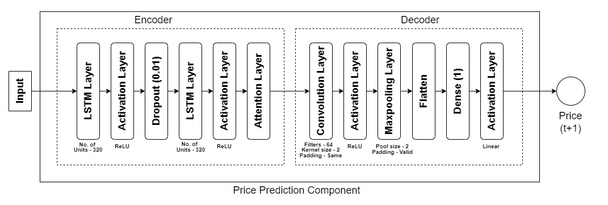
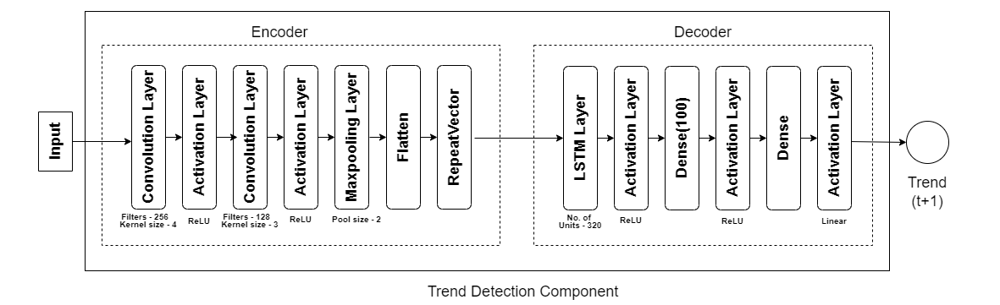

# Abstract

A Deep Learning model that combines the concept of Stop-Loss with the capabilities offered by Deep Neural Networks. The architecture is composed of three components where trend detection and price prediction components provide inputs to the stop price prediction component which predicts the variation of stop price. 

# Technical Indicator Discretisation Procedure

RSI exceeding a value of 70 indicates downtrend (-1) and falling below the 30 indicates an uptrend. For values that lie between 30 and 70, a comparison was performed with the RSI value of the preceding time step (t-1). If the current RSI is higher than the previous RSI, it is considered an uptrend (+1) and it indicates a downtrend (-1) otherwise.

Both SMA and WMA were discretized by performing a comparison with the current close price. If the current close price is greater than the moving average figure, it is considered an uptrend (+1) and a downtrend (-1) otherwise.

The Discretization rule for Momentum is simple and is based on its sign. A positive Momentum indicates an uptrend (+1) and negative value indicates a downtrend (-1).

As MACD is an indicator that follows the trend, if the current MACD is greater than the previous MACD (t-1), then it indicates an uptrend (+1) and it is considered a downtrend (-1) otherwise.

The comparison performed for all four (4) oscillators (Stochastic K\%, Stochastic D\% , A/D Oscillator and William’s R\%), is the same as that of MACD. If the indicator value at the current time step is greater than that of the previous time step, it is considered an uptrend (+1) and a downtrend (-1) otherwise.

Similar to RSI, we set two (2) limits to perform discretization on CCI as well. If the CCI value is greater than 200, it is treated as an uptrend (+1) and a downtrend if it lies below -200. If the value falls in between -200  and 200, a comparison with the CCI value of the previous time step (t-1) is performed like in the case of RSI. If the current value is greater than the previous value, it indicates an uptrend (+1) and downtrend (-1) otherwise.

# Components

## Price Prediction Component

## Trend Detection Component

# Requirements

* Python 3.8
* Tensorflow 2

# Install required packages

`pip install -r requirements.txt`

# Running the scripts

## Training

To train the model, run the Model/stop_loss_train.py with the following parameters

* $train_dataset - Training dataset
* $output_folder - Output directory (where the trained models will be saved to)

### Running the train script

`python Model/stop_loss_train.py $train_dataset $output_folder`

## Testing

To test the model, run the Model/stop_loss_test.py with the following parameters

* $test_dataset - Testing dataset
* $output_folder - Output directory (where the results will be saved to)
* $model - Path to the trained model
* $scaler - Path to the scaler used for training the model

### Running the test script

`python Model/stop_loss_testpy $test_dataset $output_folder $model $scaler`
